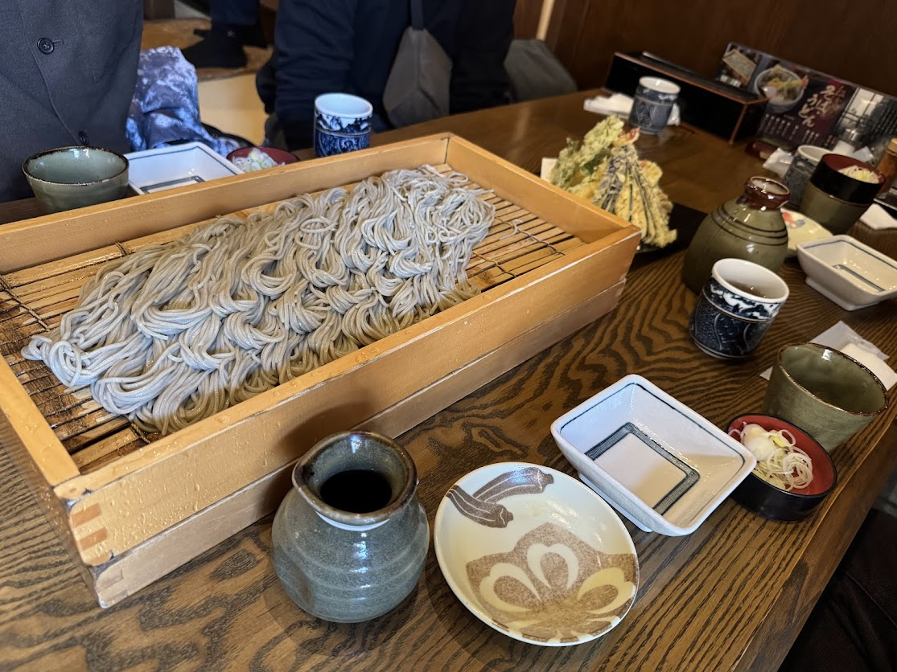
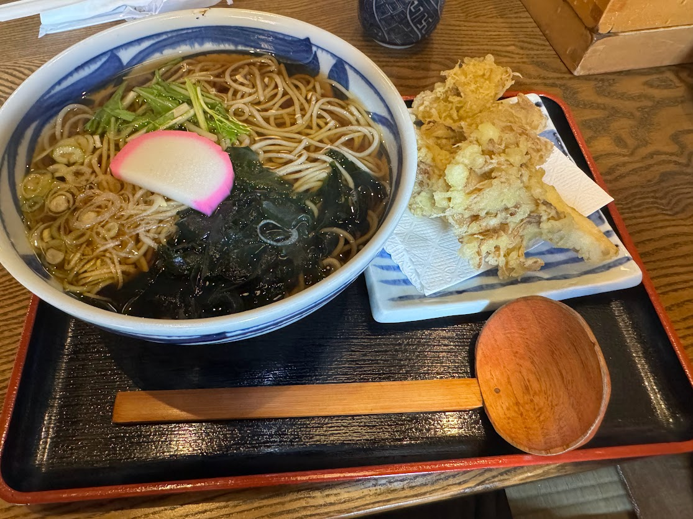

某シェアオフィスの面々と石打丸山スキー場に行き、2日間にわたって遊んできました。

今は越後湯沢駅の前の蕎麦屋で順番を待ちながら忘れないうちに書いています。

## 持っていったもの

## 一日目

一日目は主にスキーです。

### スキー場まで

前橋駅から7時8分発の電車へ乗り、高崎へ向かいました。宿及びスキー場の最寄り駅である越後湯沢は新幹線で30分程度で行けるため、車の免許を持っていない交通手段弱者である私には非常にありがたいのです。

私のお財布事情を考慮すると鈍行以外の選択肢はありえないという感じなのですが、私の周りは皆新幹線で行くらしく逸れたり合流したりするのも面倒なため新幹線を選択しました。

駅前では他のスキー場へのバスに並んでいる大勢の人(私は昨年このバスに乗って神立へ行った)を通り越して、宿や出してくれている無料の送迎車に乗車。
ディズニーのファストパスやこういった際の「並んでいる人間を横目に見ながら大幅な時間短縮を行う」という行為の際に感じる優越感を得ると旅行に来たなと実感します。
(時間は金で買えるとはこのことでしょう。)

今回宿泊した場所は[LODGE CANADA](https://www.lodgecanada.com/)さんです。

### スキー

宿に到着したら、早速お部屋に向かいます。今回の私の部屋は4人部屋で、中には金庫とテレビがある和室で真ん中にこたつが置いてありました。(写真撮り忘れました申し訳ない。)

リフト券を宿で取ってもらいお値段なんと約5000円。今回は三山共通のリフト券は使いませんでした。次は使いたいな……
午前中は初めてスキーをやるという方々に講習会。午後はスキー部の先輩とひたすら滑っていました。
この日の天気は滑り始める前までは降雪があり、滑り始めと同時に快晴になるという最高の状態でした。

山頂までリフトで登ると、他のスキー場との接続が見えると同時に下町を一望することができます。
多くのスキー場では眼の前に他の山々がﾄﾞﾝﾄﾞﾝという感じですが、このスキー場は実際に道路を車や人が歩いているような日常の生活が上から観察できます。
東京タワーのような感じで下町を覗き込みながら滑れるので非常に風景が楽しいスキー場でした。

また、このスキー場の特色として、謎の暖房付きゲーミングリフトがあります。[サンライズエクスプレス](https://ishiuchi.or.jp/winter/facilities/sunrise-express/)とかいう
この謎のゲーミングチェアの如く豪勢なこのリフトは、果たしてどこに需要があるのだろうかという感じではあるものの座り心地はやはり格別でした。
同乗可能人数もリフトで6人、ゴンドラで10人とかなりの人数が並んでいる状況にも関わらず非常に良い回転率を実現しており、結果として多く滑れたような気がします。
~~それにしても暖房機能や妙にふかふかなゲーミングチェアは不要な気がしますが。~~

<!-- ここにリフトの写真 -->

昼食はスキー場の中腹にあるロッジで取りました。20歳になって初めてのスキーなのでスキー場でお酒を飲むのも初めてだったのですが、ここまでビールを美味しく感じたのは初めてでした。
カレーを食べて(写真撮り忘れ2)、そのまま後半はスキー部の先輩とひたすら滑りました。

ずっと独学と見様見真似でスキーをやっているので、パラレルが一切できず非常にカッコ悪い感じの滑り方になってしまいます。
どうにかパラレルをできるようになろうと練習を繰り返しているうちに気がついたら上級者コース(ダイナミックBコース)で思いっきり転倒しました。
板が雪に引っ張られてバランスを崩し、そのまま右足首を大きく捻って全身を強く打ち、板やストックが全部はずれた状態で下方へ3mほど転げ落ちました。

非常に急な坂なので少しでも動くと下に転げ落ちてしまうという状況で、どうしたものかと悩んでいるとめちゃくちゃ上手なスキーヤーの方が助けていただきました。
自分が憧れている将来像の1つが、この「めちゃくちゃスキーが上手い上に助けてくれるイケオジ」になりたいという密かな目標があります。

そんなこんなで16:30まで滑りました。一部のリフトが16:00で終了してしまうことを知らず、板を持って坂道を登ったことが体力を大きく消費する要因となり、
これ以上は足の疲労でコントロールが効かなくなりそうということでナイターを滑ることなく終了してしまいました。

このスキー場は昼間とナイターで具体的な境界がなく、一部のリフトは夜遅くまでやってると言った感じでリフト券も共通であるという珍しい感じです。
家に引きこもってるだけでなく体力をつけないとスポーツを十分に楽しむことはできないと日頃の運動不足を後悔しております。

コースも多い上に雪質も良く、シーズン真っ只中であるにも関わらずリフトに並ぶのは長くても数分と非常に快適なスキー場でした。
三山のリフト券や1度しか行けなかったコースも多いので、是非また行ってみたいスキー場だと思いました。

### 銭湯

当初は別の温泉に行こうとしていたものの「あそこは混んでて入浴を断られるよ」とロッジのおじさんに助言されました。
念の為電話で確認を行うと確かに定員に達しているので難しいという返事をもらった結果、またまたロッジのおじさんに代替案を教えていただきました。

そして向かったのが「ハツカ石温泉 石打ユングパルナス」です。多くのスキーヤー・ボーダーで非常に賑わっていました。
我々は温泉として向かいましたが旅館でもあるようです。ロッジのおじさんに200円割引券を頂いたので(!!)、700円で入浴できました。

お風呂の中は2種類のサウナと多くの種類の温泉があり、非常に楽しめるものでした。

## 二日目

2日目はスキーはせず、観光して午後には帰ります。

### お昼ごはん

ロッジの送迎で駅まで送ってもらった後、越後湯沢駅周辺の観光をしました。
駅構内には非常に多くの観光客向けの店があり、そこだけでもかなりの新潟成分を堪能した気分になれます。(当然割高ですが)

お昼ごはんはすぐ駅前にある「そば処 中野屋 湯沢本店」。

へぎ蕎麦というものを人生で初めて目にしました。風味豊かで非常に美味でした。

### 日本酒

その後、駅の中にある「ぽんしゅ館 越後湯沢驛店」で日本酒を試飲。コインをいれるとお猪口で日本酒を試飲できるという場所。500円でコイン5枚と交換します。

殆どの日本酒はコイン1枚ですが、一部の人気なものはコイン2枚になるという仕組み。

私はお酒に詳しくないので、素直にランキングに掲載されていた1位の「N-888 Premium 生原酒」と2位の「越の寒中梅 原酒」、そして5位の「イットキー」を呑みました。

今までしっかりと日本酒を飲み比べたことはなかったのですが、非常に楽しい場所でした。特に、「イットキー」は今までとは次元の違う-40という日本酒度で、ジュースのような感じでした。

(語彙力のない感想で申し訳ない。まだ二十歳なのでお酒の経験がほぼ無いのです……)

### 散策

その後は周囲を散策しました。個人的には駅の西口側に行けなかったことが残念……。越後湯沢駅は今回が2度目で、前回のときも東口しかいけませんでした。

どうやら駅周辺には足湯やらラーメン屋やらがあるらしいので、こちらも何かの機会があれば行ってみたいところ。
